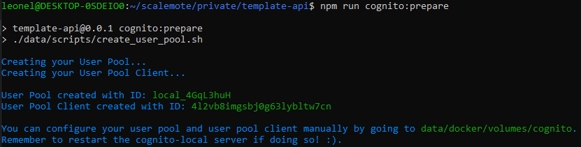

# Setup

## Prerequisites

- [Node >= 18](https://github.com/nvm-sh/nvm)
- If using Cognito, [AWS CLI](https://docs.aws.amazon.com/cli/latest/userguide/getting-started-install.html).

## Setting up the project

1. Run `npm ci` to install the project's dependencies.
2. Run `dev:prepare` to generate the environment variables for the application.
3. Spin up the docker container by running `docker compose up -d`.

If you are going to use AWS Cognito as Identity Provider, you will want to have a User Pool and User Pool Client for development. The template uses [cognito-local](https://github.com/jagregory/cognito-local) as an emulator for the real thing and also provides a useful command to generate both the User Pool and User Pool Client using the emulator.

To configure the emulator for local environment, follow these steps:

1. Run `aws configure` and complete the prompts. You don't need to put any real values here, but the emulator requires you to have the AWS CLI configured with any credentials if you want to use the CLI against it. Here are some example of credentials that will get you going:

```
ACCESS_KEY: X
SECRET KEY: Y
REGION: ap-southeast-2
OUTPUT: json
```


2. run `cognito:prepare` to generate a User Pool and User Pool Client for local development. The console will print in your terminal the `UserPoolId` and the `UserPoolClientId` needed for the API to validate JWTs with Cognito as the issuer. You need to put these values in your `.env` file. Any modification to the User Pool or User Pool Client can be made manually in `data/docker/volumes/cognito`. Changes will be applied after restarting the Cognito container.




3. Once you have the server up and running you will need to make this template appropiate for the project you're working on, that means replacing all the placeholder information (like project name, description and authors) with the ones of your project in `package.json`, `Swagger` and `Postman collections`.

## Recommended Tools

We recommend these tools to have the best possible development experience when using this template:

- [Eslint](https://marketplace.visualstudio.com/items?itemName=dbaeumer.vscode-eslint)
- [Prettier](https://marketplace.visualstudio.com/items?itemName=esbenp.prettier-vscode)
- [EditorConfig for VS Code](https://marketplace.visualstudio.com/items?itemName=EditorConfig.EditorConfig)
- [Git Blame](https://marketplace.visualstudio.com/items?itemName=waderyan.gitblame)
- [Codeium](https://marketplace.visualstudio.com/items?itemName=Codeium.codeium)
- [YAML](https://marketplace.visualstudio.com/items?itemName=redhat.vscode-yaml)
- [PlantUML](https://marketplace.visualstudio.com/items?itemName=jebbs.plantuml)
